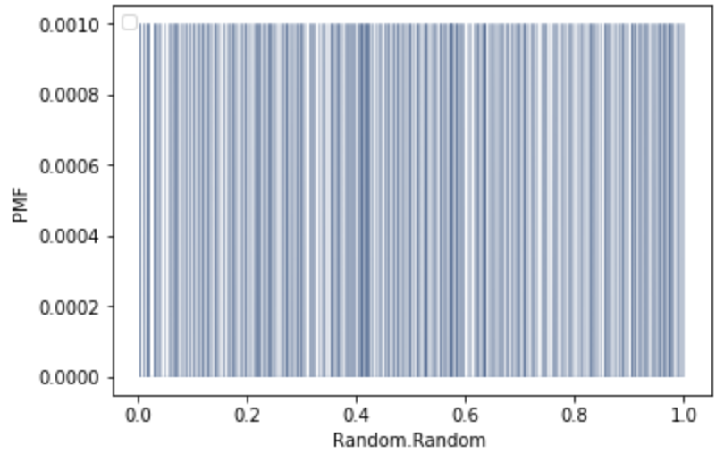
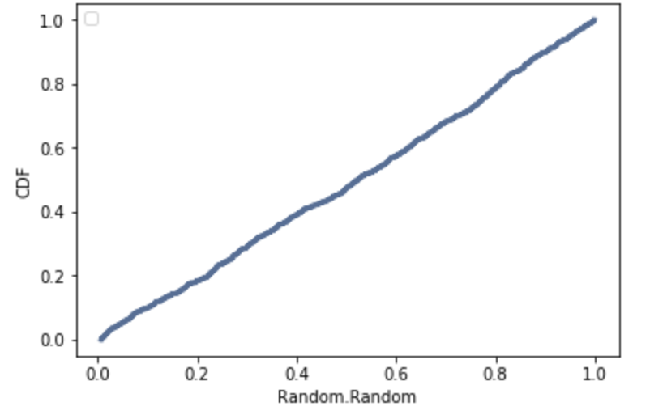

[Think Stats Chapter 4 Exercise 2](http://greenteapress.com/thinkstats2/html/thinkstats2005.html#toc41) (a random distribution)

>>First, I generated 1000 numbers between 0 and 1 using random.random and plotted their PMF:

```python
import numpy as np
import thinkstats2
randomNumbers = np.random.random(1000)
pmf = thinkstats2.PMF(randomNumbers)
thinkplot.Pmf(pmf, linewidth=0.1)
thinkplot.Config(xlabel='Random.Random ', ylabel='PMF')
```


But it's very difficult to visually distinguish if it is a uniform distribution

Next, I plotted the CDF:

```python
cdf = thinkstats2.Cdf(t)
thinkplot.Cdf(cdf)
thinkplot.Config(xlabel='Random.Random', ylabel='CDF')
```
  
since the cdf is approximately a straight line, the distribution is uniform.
